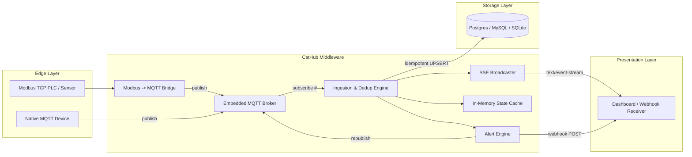

# CatHub

**A single-binary, deterministic realtime hub for Industrial IoT (IIoT).**

CatHub collapses the typical IIoT ingestion stack — MQTT broker, worker, database, web server — into one Rust binary, so an edge gateway or small VPS can ingest, deduplicate, persist, and broadcast telemetry without an orchestration layer. It also bridges legacy Modbus TCP devices onto that same pipeline, so PLCs and sensors that don't speak MQTT natively don't need a separate gateway.

> **Project status: early / actively developed.** The core pipeline described below is implemented and has been exercised end-to-end (MQTT ingest → dedup → vault → SSE → alerts). It has not been run against real factory hardware or under production load. See [Current Status](#current-status) for specifics.

## Table of Contents

- [Vision](#vision)
- [Current Status](#current-status)
- [Architecture](#architecture)
- [Tech Stack](#tech-stack)
- [Getting Started](#getting-started)
- [Configuration](#configuration)
- [API Reference](#api-reference)
- [Roadmap](#roadmap)
- [Contributing](#contributing)
- [License](#license)

## Vision

Industrial environments (e.g. factories using Carlo Gavazzi UWP 4.0 gateways) need strict data determinism, zero duplication, and real-time visualization, without wiring together Mosquitto/EMQX, a worker process, a database, and a web server by hand. CatHub's design:

1. **Embedded MQTT Ingestor** — devices connect directly to CatHub; no external broker to run.
2. **Modbus TCP → MQTT Bridge** — legacy PLCs and sensors that only speak Modbus are polled and republished as MQTT, so they flow through the same pipeline as native MQTT devices.
3. **Deterministic Vault** — idempotent writes to Postgres/MySQL/SQLite so duplicate telemetry (from flaky factory networks or repeated Modbus polls) never lands twice.
4. **Real-time Broadcaster** — built-in Server-Sent Events (SSE) so dashboards can stream live data without hitting the database.
5. **Threshold Alerting** — simple rules re-publish to MQTT or POST a webhook when a value crosses a configured threshold.

## Current Status

| Component | Status | Notes |
|---|---|---|
| Embedded MQTT broker (`rumqttd`) | ✅ Working | Real devices can connect on `MQTT_LISTEN_ADDR` (default `0.0.0.0:1883`) |
| Ingestion & dedup engine | ✅ Working | Byte-identical repeat payloads for a topic are dropped before they reach the vault, SSE, or alerts |
| In-memory state cache | ✅ Working | `GET /api/state` / `GET /api/state/{topic}` |
| `GET /api/stream` (SSE) | ✅ Working | Streams every deduplicated message live |
| Deterministic Vault (Postgres/MySQL/SQLite via `sqlx::Any`) | ✅ Working | Per-backend UPSERT SQL (see [Roadmap](#roadmap) for the schema-inference limitation) |
| Modbus TCP → MQTT bridge | ✅ Working, untested against real hardware | Configured via `cathub.toml`; reconnects every poll cycle rather than holding a persistent session |
| Threshold alerting (MQTT republish + webhook) | ✅ Working | Edge-triggered: fires once per threshold crossing, not on every message |
| `GET /health` | ✅ Working | Reports DB status, Modbus device count, alert rule count |

### Security posture (read before exposing beyond localhost)

This is an early-stage project; the following are known, deliberate gaps rather than oversights, and are called out here so they aren't discovered the hard way:

- **MQTT broker has no authentication unless you set it.** Set both `MQTT_USERNAME` and `MQTT_PASSWORD` (see [`.env.example`](.env.example)) before exposing `MQTT_LISTEN_ADDR` beyond localhost or a trusted network segment — otherwise anyone who can reach that port can publish to any topic.
- **The HTTP API (`/api/state*`, `/api/stream`) has no authentication at all.** It's read-only, but it discloses every ingested topic's current value to anyone who can reach port 3000. Put it behind a reverse proxy with auth, or a network ACL, before exposing it.
- **The state cache and vault cap topic handling defensively**, not because either is expected in normal operation: at most 10,000 distinct topics are tracked at once (further new topics are dropped, not evicted-and-replaced — see `src/cache.rs`), and topics longer than 255 bytes are rejected outright (matching the MySQL vault schema's column width). Both exist specifically because an unauthenticated broker would otherwise let a remote publisher exhaust memory with unique topics.
- **Webhook calls have a 10s timeout** and the configured URL is redacted before it's logged, but the URL and payload themselves are not validated (e.g. `http://` vs `https://` is not enforced) — `webhook_url` is operator-configured via `cathub.toml`, not attacker-controlled at runtime, but treat it with the same care as any other credential-bearing config value.
- **No TLS** on the MQTT broker or the HTTP server. Fine on a trusted LAN or behind a VPN; put a TLS-terminating proxy in front of both before crossing an untrusted network.

## Architecture



## Tech Stack

| Concern | Crate |
|---|---|
| HTTP server | [`actix-web`](https://crates.io/crates/actix-web) |
| Async runtime | [`tokio`](https://crates.io/crates/tokio) |
| Embedded MQTT broker | [`rumqttd`](https://crates.io/crates/rumqttd) |
| Modbus TCP client | [`tokio-modbus`](https://crates.io/crates/tokio-modbus) |
| Database access | [`sqlx`](https://crates.io/crates/sqlx) (`Any` driver: Postgres, MySQL, SQLite) |
| In-memory state cache | [`dashmap`](https://crates.io/crates/dashmap) |
| Webhook dispatch | [`ureq`](https://crates.io/crates/ureq) |
| Config | [`dotenvy`](https://crates.io/crates/dotenvy) (`.env`), [`toml`](https://crates.io/crates/toml) (`cathub.toml`) |
| Serialization | [`serde`](https://crates.io/crates/serde) / [`serde_json`](https://crates.io/crates/serde_json) |
| Logging | [`tracing`](https://crates.io/crates/tracing) / [`tracing-subscriber`](https://crates.io/crates/tracing-subscriber) |

## Getting Started

### Prerequisites

- [Rust](https://www.rust-lang.org/tools/install) (stable toolchain, 2021 edition)
- Optionally, a Postgres, MySQL, or SQLite database if you want persistence instead of No-DB mode
- Optionally, a Modbus TCP device (or simulator) if you want to use the bridge

### Build & Run

```bash
# Clone the repository
git clone https://github.com/dhimasarista/cathub.git
cd cathub

# Copy the example environment file and adjust as needed
cp .env.example .env

# Optional: enable Modbus devices and/or alert rules
cp cathub.toml.example cathub.toml

# Run in debug mode
cargo run

# Or build an optimized release binary
cargo build --release
./target/release/cathub
```

On startup, CatHub logs whether it connected to a database or is running in No-DB mode, how many Modbus devices and alert rules were loaded from `cathub.toml`, then starts the MQTT broker (`MQTT_LISTEN_ADDR`) and the HTTP broadcaster (`http://0.0.0.0:3000`).

### Verify it's running

```bash
curl http://localhost:3000/health
# {"alert_rules":0,"database":"No-DB Mode","modbus_devices":0,"status":"ok"}
```

### Run the tests

```bash
cargo test
```

## Configuration

CatHub reads two files: `.env` (via `dotenvy`) for runtime/environment settings, and `cathub.toml` (optional) for Modbus devices and alert rules. See [`.env.example`](.env.example) and [`cathub.toml.example`](cathub.toml.example) for the full, commented reference.

| Variable | Required | Default | Description |
|---|---|---|---|
| `DATABASE_URL` | No | *(unset)* | Postgres/MySQL/SQLite connection string. Omit to run in No-DB (broadcast-only) mode. |
| `RUST_LOG` | No | `info` | Log verbosity for the `tracing` subscriber. |
| `MQTT_LISTEN_ADDR` | No | `0.0.0.0:1883` | Address the embedded MQTT broker listens on. |
| `MQTT_USERNAME` / `MQTT_PASSWORD` | No | *(unset)* | Credentials required from MQTT clients. Unset means unauthenticated — see [Security posture](#security-posture-read-before-exposing-beyond-localhost). |
| `HTTP_LISTEN_ADDR` | No | `0.0.0.0:3000` | Address the HTTP broadcaster listens on. |

`cathub.toml` has two top-level array sections, both optional and independent:

- `[[modbus]]` — Modbus TCP devices to poll and bridge onto MQTT.
- `[[alerts]]` — threshold rules evaluated against ingested JSON payloads.

Neither file is required to start CatHub: with no `.env` and no `cathub.toml`, it runs in No-DB mode with no Modbus devices and no alert rules — a plain embedded MQTT broker with SSE broadcasting.

## API Reference

| Method | Path | Description |
|---|---|---|
| `GET` | `/health` | Process health, DB status, Modbus device count, alert rule count |
| `GET` | `/api/stream` | Server-Sent Events stream of every deduplicated ingested message |
| `GET` | `/api/state` | JSON snapshot of the latest value for every known topic |
| `GET` | `/api/state/{topic}` | Latest value for one topic (`404` if never seen) |

## Roadmap

- [ ] **Per-topic dynamic schema inference is deliberately not implemented.** The vault currently stores every topic's latest payload as an opaque JSON string in one fixed `telemetry_latest` table (topic, payload, updated_at) rather than generating per-field typed columns/tables from untrusted MQTT topic names and JSON keys. Doing that safely requires strict identifier sanitization, migration handling for schema drift, and per-backend type mapping — real work, not a one-line addition — so it's left for a dedicated pass rather than shipped half-safe.
- [ ] Persistent (rather than reconnect-per-poll) Modbus TCP sessions for high-frequency polling
- [ ] MQTT wildcard (`+`/`#`) support in alert rule topic matching
- [ ] Historical time-series storage (currently only the *latest* value per topic is persisted) — likely a `telemetry_history` table gated behind config, so it's opt-in rather than unconditionally multiplying write volume
- [ ] Integration tests against a real Modbus simulator and a real Postgres/MySQL instance (current tests cover the pure logic: dedup, alert edge-triggering, per-backend SQL generation, config parsing)
- [ ] CI workflow (`cargo check`, `cargo test`, `cargo clippy`)
- [ ] Document deployment (systemd unit / container image) for edge gateways

## Contributing

This project is in early, active development. Issues and pull requests are welcome via [GitHub](https://github.com/dhimasarista/cathub).

## License

No license has been declared for this project yet. All rights reserved by the author until a license is added.

---

*Built for the industrial edge.*
