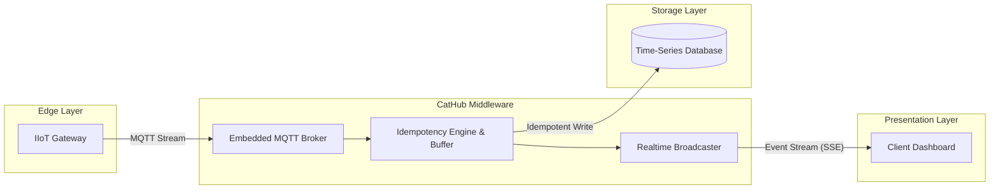

# CatHub 🐈

**The All-in-One, Deterministic IIoT Realtime Hub**

CatHub is a blazing-fast, single-binary middleware designed specifically for Industrial IoT (IIoT). It eliminates the complex, resource-heavy chain of traditional IIoT architectures (Broker → Worker → Database → Web Server) by fusing them into one hyper-optimized Rust application.

## 🌟 The Vision

Industrial environments (like factories using Carlo Gavazzi UWP 4.0 gateways) require strict data determinism, zero duplication, and real-time visualization. CatHub solves the "integration spaghetti" by providing:

1. **Embedded MQTT Ingestor:** Devices connect directly to CatHub. No need to set up Mosquitto or EMQX.
2. **Deterministic Vault:** Mathematically idempotent database writes to PostgreSQL/TimescaleDB. Say goodbye to duplicate telemetry data caused by flaky factory networks.
3. **Real-time Broadcaster:** Built-in Server-Sent Events (SSE). Client-side applications can stream live sensor data with < 1ms latency, completely bypassing the database.

## 🚀 Key Features

- **Single Executable:** No JVM, no heavy runtimes. Drop the binary on an edge gateway or VPS, and it runs.
- **Zero-GC Overhead:** Written in Rust, guaranteeing predictable CPU usage and constant low-memory footprint (typically < 20MB RAM) regardless of throughput.
- **Absolute Idempotency:** Automatically buffers and converts MQTT JSON payloads into strictly structured `UPSERT` queries.
- **Client-Ready:** The `/api/stream` endpoint provides a clean SSE stream out-of-the-box for instant client-side dashboard updates.

## 🏗️ Architecture

## 🛠️ Getting Started

*(Instructions on building and running the project will be added as the API stabilizes).*

## 💡 Why Rust?

CatHub is built with Rust to provide the ultimate guarantees for infrastructure software: memory safety without garbage collection pauses, fearless concurrency, and predictable performance. It acts as the perfect "Shock Absorber" between high-frequency machine data and the rest of your enterprise stack.

---
*Built for the modern industrial edge.*
