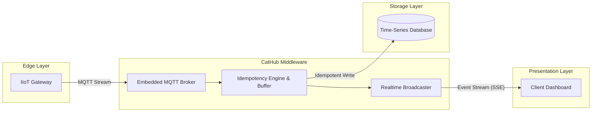

# CatHub

**A single-binary, deterministic realtime hub for Industrial IoT (IIoT).**

CatHub aims to collapse the typical IIoT ingestion stack — MQTT broker, worker, database, web server — into one Rust binary, so an edge gateway or small VPS can ingest, deduplicate, persist, and broadcast telemetry without an orchestration layer.

> **Project status: early-stage / pre-alpha.** The HTTP server and database bootstrap are working; the MQTT broker and idempotent write path described in the vision below are not implemented yet. See [Current Status](#current-status) for what actually runs today.

## Table of Contents

- [Vision](#vision)
- [Current Status](#current-status)
- [Architecture](#architecture)
- [Tech Stack](#tech-stack)
- [Getting Started](#getting-started)
- [Configuration](#configuration)
- [API Reference](#api-reference)
- [Roadmap](#roadmap)
- [Contributing](#contributing)
- [License](#license)

## Vision

Industrial environments (e.g. factories using Carlo Gavazzi UWP 4.0 gateways) need strict data determinism, zero duplication, and real-time visualization, without wiring together Mosquitto/EMQX, a worker process, a database, and a web server by hand. CatHub's target design:

1. **Embedded MQTT Ingestor** — devices connect directly to CatHub; no external broker to run.
2. **Deterministic Vault** — idempotent writes to Postgres/MySQL/SQLite so duplicate telemetry (from flaky factory networks) never lands twice.
3. **Real-time Broadcaster** — built-in Server-Sent Events (SSE) so dashboards can stream live data without hitting the database.

## Current Status

| Component | Status | Notes |
|---|---|---|
| HTTP server (Actix-Web) | ✅ Working | Binds on `0.0.0.0:3000` |
| `GET /health` | ✅ Working | Reports process + DB status |
| Database bootstrap (Postgres/MySQL/SQLite via `sqlx::Any`) | ✅ Working | Falls back to No-DB mode if `DATABASE_URL` is unset or unreachable |
| `GET /api/stream` (SSE) | 🚧 Stub | Returns a static placeholder body, not a live stream |
| Embedded MQTT broker (`rumqttd`) | 🚧 Not started | Dependency is present; broker task is unimplemented |
| Idempotent write / dedup engine | 🚧 Not started | No ingestion or persistence logic yet |

## Architecture

The diagram below reflects the **target** architecture. Solid boxes exist today; the MQTT broker, idempotency engine, and live SSE stream are planned (see [Current Status](#current-status)).



## Tech Stack

| Concern | Crate |
|---|---|
| HTTP server | [`actix-web`](https://crates.io/crates/actix-web) |
| Async runtime | [`tokio`](https://crates.io/crates/tokio) |
| MQTT broker (planned) | [`rumqttd`](https://crates.io/crates/rumqttd) |
| Database access | [`sqlx`](https://crates.io/crates/sqlx) (`Any` driver: Postgres, MySQL, SQLite) |
| Config | [`dotenvy`](https://crates.io/crates/dotenvy) |
| Serialization | [`serde`](https://crates.io/crates/serde) / [`serde_json`](https://crates.io/crates/serde_json) |
| Logging | [`tracing`](https://crates.io/crates/tracing) / [`tracing-subscriber`](https://crates.io/crates/tracing-subscriber) |

## Getting Started

### Prerequisites

- [Rust](https://www.rust-lang.org/tools/install) (stable toolchain, 2021 edition)
- Optionally, a Postgres, MySQL, or SQLite database if you want persistence instead of No-DB mode

### Build & Run

```bash
# Clone the repository
git clone https://github.com/dhimasarista/cathub.git
cd cathub

# Copy the example environment file and adjust as needed
cp .env.example .env

# Run in debug mode
cargo run

# Or build an optimized release binary
cargo build --release
./target/release/cathub
```

On startup, CatHub logs whether it connected to a database or is running in No-DB mode, then starts listening on `http://0.0.0.0:3000`.

### Verify it's running

```bash
curl http://localhost:3000/health
# CatHub is running deterministically. DB Status: No-DB Mode
```

## Configuration

CatHub is configured entirely through environment variables (loaded from `.env` via `dotenvy` if present). See [`.env.example`](.env.example) for the full list.

| Variable | Required | Default | Description |
|---|---|---|---|
| `DATABASE_URL` | No | *(unset)* | Postgres/MySQL/SQLite connection string. Omit to run in No-DB (broadcast-only) mode. |
| `RUST_LOG` | No | `info` | Log verbosity for the `tracing` subscriber. |

## API Reference

| Method | Path | Status | Description |
|---|---|---|---|
| `GET` | `/health` | Stable | Returns process health and current DB connection status |
| `GET` | `/api/stream` | Stub | Intended to serve a live SSE telemetry stream; currently returns a static placeholder |

## Roadmap

- [ ] Implement the embedded `rumqttd` broker as a real ingestion path
- [ ] Design the idempotency/dedup strategy for the `Any`-driver vault (UPSERT semantics differ across Postgres/MySQL/SQLite, so this needs explicit per-backend handling)
- [ ] Wire ingested MQTT messages into a broadcast channel consumed by `/api/stream`
- [ ] Add integration tests for the HTTP layer and database fallback behavior
- [ ] Add a CI workflow (`cargo check`, `cargo test`, `cargo clippy`)
- [ ] Document deployment (systemd unit / container image) for edge gateways

## Contributing

This project is in early, active development. Issues and pull requests are welcome via [GitHub](https://github.com/dhimasarista/cathub).

## License

No license has been declared for this project yet. All rights reserved by the author until a license is added.

---

*Built for the industrial edge.*
